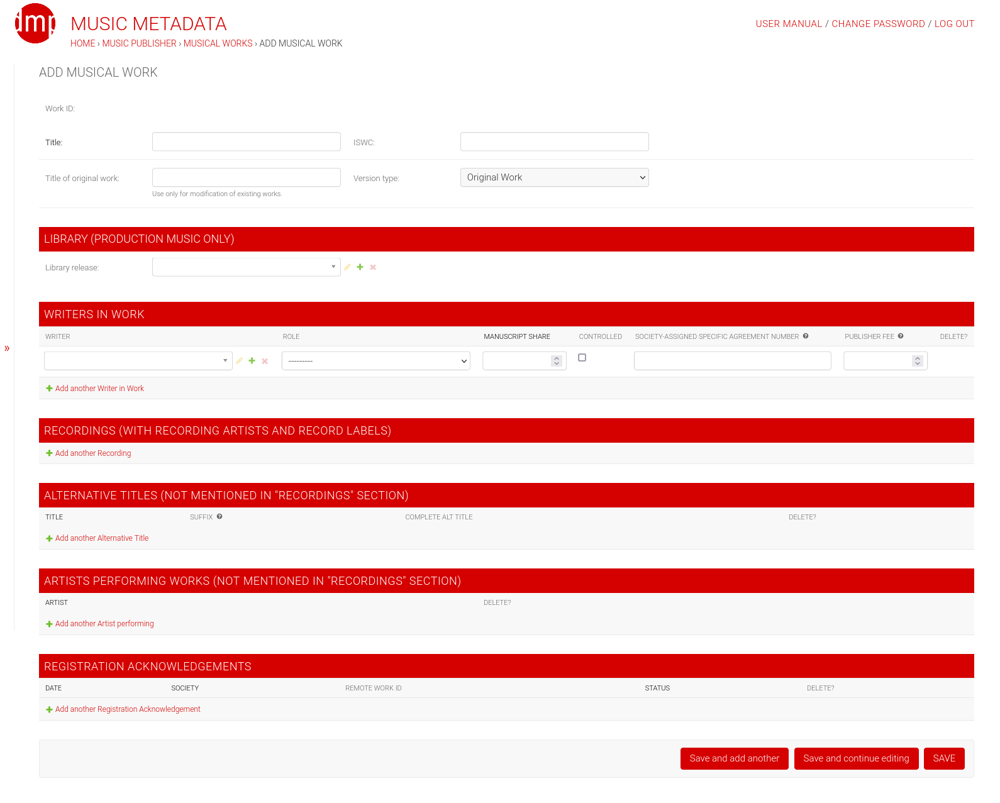

Django-Music-Publisher - Free music publishing software
+++++++++++++++++++++++++++++++++++++++++++++++++++++++++++++++++++++++++++++++++

.. image:: https://github.com/matijakolaric-com/django-music-publisher/workflows/build/badge.svg?branch=master
    :target: https://github.com/matijakolaric-com/django-music-publisher/actions/workflows/build.yml
    :alt: Build Status
.. image:: https://img.shields.io/readthedocs/django-music-publisher?logo=read-the-docs   
    :target: https://django-music-publisher.readthedocs.io/en/latest/
    :alt: Documentation Status
.. image:: https://img.shields.io/coveralls/github/matijakolaric-com/django-music-publisher/master?logo=coveralls&branch=master
    :target: https://coveralls.io/github/matijakolaric-com/django-music-publisher?branch=master
    :alt: Coverage Status
.. image:: https://img.shields.io/github/license/matijakolaric-com/django-music-publisher.svg?logo=github
    :target: https://github.com/matijakolaric-com/django-music-publisher/blob/master/LICENSE
    :alt: License
.. image:: https://img.shields.io/pypi/v/django-music-publisher.svg?logo=pypi
    :target: https://pypi.org/project/django-music-publisher/
    :alt: PYPI
.. image:: https://img.shields.io/github/issues/matijakolaric-com/django-music-publisher/bug?logo=github
    :target: https://github.com/matijakolaric-com/django-music-publisher/issues
    :alt: GitHub issues

Django-Music-Publisher (DMP) is open source software for **managing music metadata**, **registration/licencing of musical works** and **royalty processing**.

* Home: https://dmp.matijakolaric.com/
* Docs: https://django-music-publisher.readthedocs.io/
* Code: https://github.com/matijakolaric-com/django-music-publisher/
* PYPI: https://pypi.org/project/django-music-publisher/
