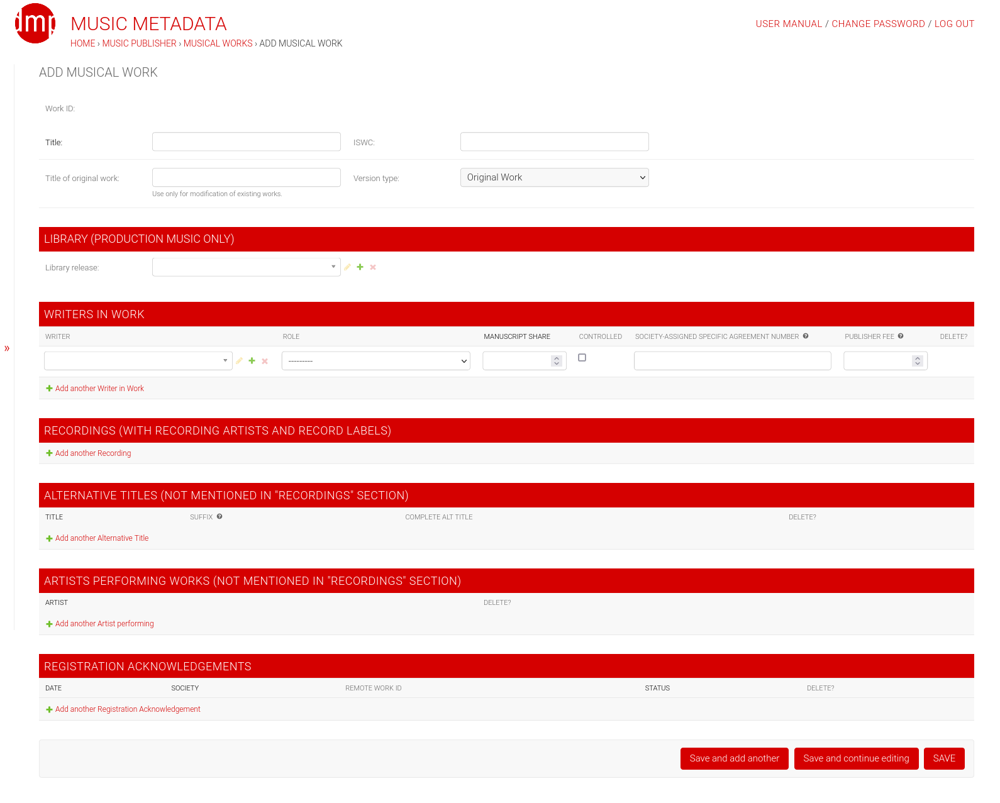

Django-Music-Publisher - Free music publishing software
+++++++++++++++++++++++++++++++++++++++++++++++++++++++++++++++++++++++++++++++++

.. image:: https://img.shields.io/github/actions/workflow/status/matijakolaric-com/django-music-publisher/build.yml?branch=master
    :target: https://github.com/matijakolaric-com/django-music-publisher/actions/workflows/build.yml
    :alt: Build Status
.. image:: https://img.shields.io/github/issues/matijakolaric-com/django-music-publisher/bug?logo=github&logoColor=white
    :target: https://github.com/matijakolaric-com/django-music-publisher/issues?q=is%3Aissue+is%3Aopen+label%3Abug
    :alt: Open bug reports
.. image:: https://img.shields.io/readthedocs/django-music-publisher?logo=read-the-docs&logoColor=white
    :target: https://django-music-publisher.readthedocs.io/en/latest/
    :alt: Documentation Status
.. image:: https://img.shields.io/coveralls/github/matijakolaric-com/django-music-publisher/master?logo=coveralls&branch=master&logoColor=white
    :target: https://coveralls.io/github/matijakolaric-com/django-music-publisher?branch=master
    :alt: Coverage Status
.. image:: https://img.shields.io/badge/linting-ruff-D7FF64?logo=ruff&logoColor=000000
    :target: https://github.com/astral-sh/ruff
    :alt: Ruff
.. image:: https://img.shields.io/pypi/v/django-music-publisher.svg?logo=pypi&logoColor=white
    :target: https://pypi.org/project/django-music-publisher/
    :alt: PYPI
.. image:: https://img.shields.io/pypi/wheel/django-music-publisher?logo=pypi&logoColor=white
    :target: https://pypi.org/project/django-music-publisher/
    :alt: PyPI - Wheel
.. image:: https://img.shields.io/badge/Django-5.2-092E20?logo=django&logoColor=white
    :target: https://github.com/matijakolaric-com/django-music-publisher/blob/master/requirements.txt
    :alt: Django version from requirements.txt
.. image:: https://img.shields.io/badge/Python-3.12%20%7C%203.13-3776AB?logo=python&logoColor=white
    :target: https://github.com/matijakolaric-com/django-music-publisher/blob/master/.github/workflows/build.yml
    :alt: Python versions tested in build workflow
.. image:: https://img.shields.io/github/license/matijakolaric-com/django-music-publisher.svg?logo=github&logoColor=white
    :target: https://github.com/matijakolaric-com/django-music-publisher/blob/master/LICENSE
    :alt: License

Django-Music-Publisher (DMP) is open source software for **managing music metadata**, **registration/licensing of musical works**, **royalty management** and **music data distribution**.

* Docs: https://django-music-publisher.readthedocs.io/
* Code: https://github.com/matijakolaric-com/django-music-publisher/
* PYPI: https://pypi.org/project/django-music-publisher/