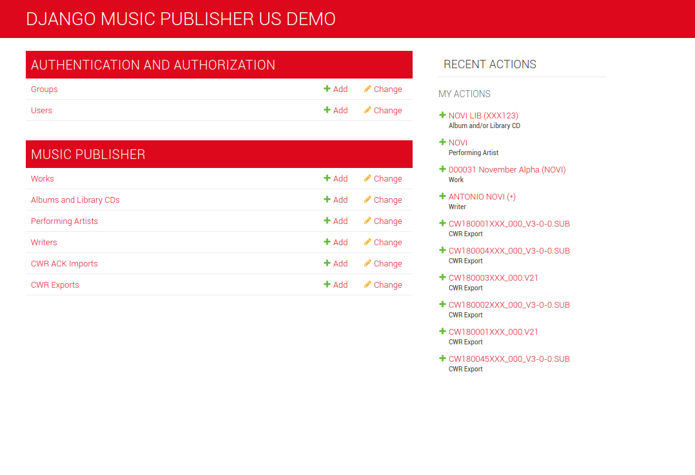
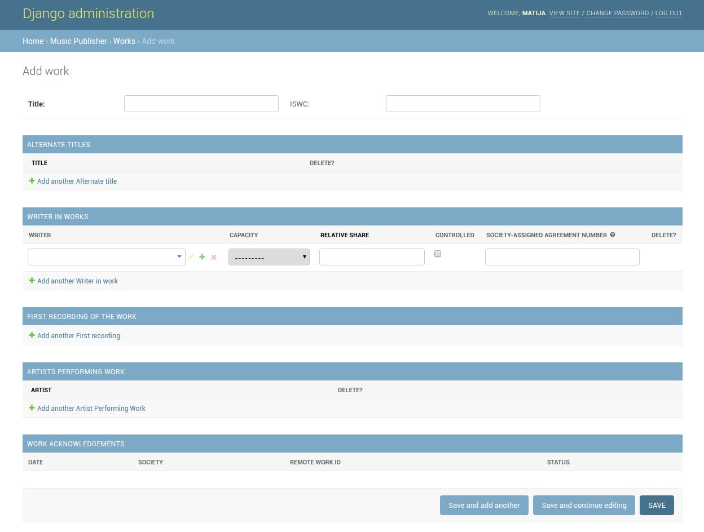
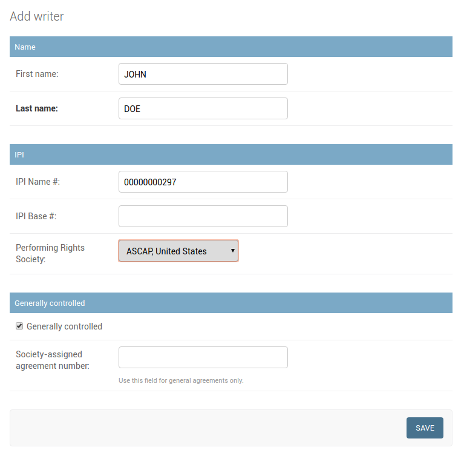
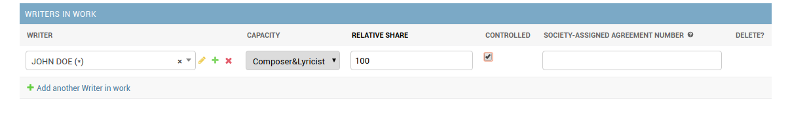
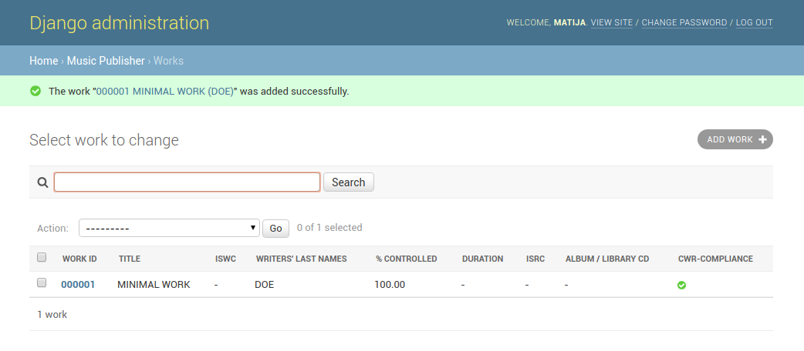
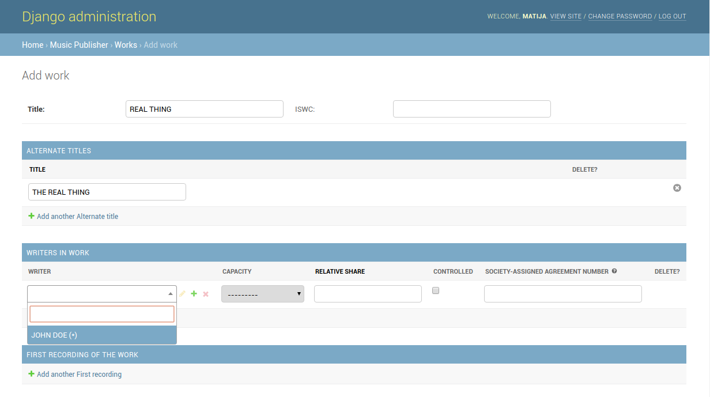
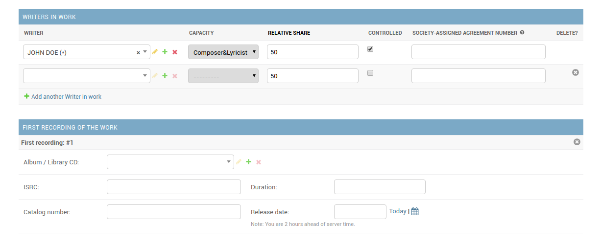
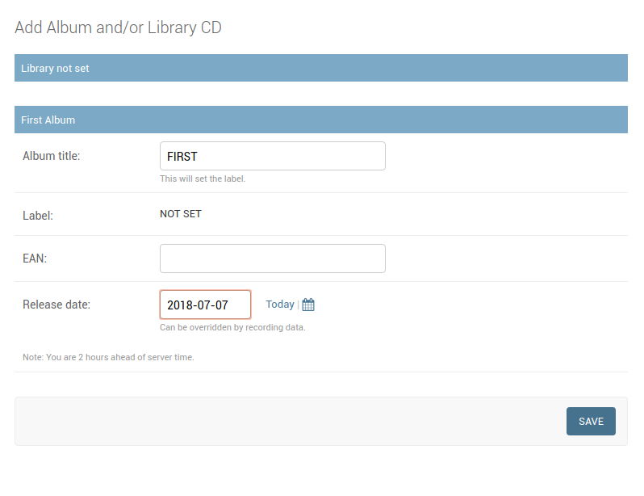
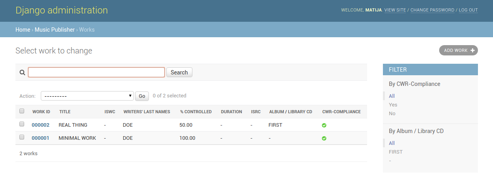

# User's Manual for Django Music Publisher

This is User's Manual for Django Music Publisher app. It presumes that installation was successful and user has logged in.
It also presumes you have acquired the token for the CWR validation and generation service.

After logging in, the home view of the administration interface is shown. User administration is not covered.

Music Publisher app has several models, each has three views: list, add and change. We will start by adding a
new work. Click on the **Add** next to **Work**.

The **add view** for works is shown. Please note that Work **change view** is exactly same, so it will not be described
separately, but this is not the case with some of the other models. It has six parts:

* Title and ISWC
* Alternate Titles
* Writers in Work
* First Recording of the Work
* Artists Performing Work
* Work Acknowledgements

For a minimal work registration, all we need to enter are the *title*, and one *writer in work* record. So, let us do that.
We will put ``MINIMAL WORK`` in the field ``title`` and then press on the ``+`` sign in the ``writer`` column of the first
``writer in work`` row. A popup will appear (if it does not, one may need to allow popups explicitely).

We will fill the minimal data for a controlled writer. If this writer is controlled in all works, e.g., there is a general
agreement between the original publisher and this writer, check 'generally controlled'. If your society requires it, also
enter the ``society-assigned agreement number``. Your society will provide you with information on agreement registrations.
Press ``save`` and you will return to the work **add view**. Please fill out the rest of the row.

There is another ``society-assigned agreement number`` field here. The former is for **general agreements**, and this one is
for **specific agreements**. If you fill out both, the specific (latter, this) one will be used. Press ``save``. You will
be taken to the work **list view**.

Let's break down this view. In top right, there is the ``add work`` button, which takes you to the **add view**, already described. Below it is a group of filters, which we will cover a bit later.

On the left side, there is a search filter. It searches for works with a matching title, including alternate titles, 
writer's last lame, ISWC and internal work ID. Below it is an action selection field. Currently, the only available
action is ``Create CWR from selected works``, which will be covered in detail later. Below it is a table with works, all
of them, or just those matching selected filters and/or a search term.

Let's add another work, this time a more complicated one. Press on ``add work``. Enter the title, and click on 
``Add another Alternate Title``, and enter an alternate title. When you enter the ``writer`` field, ``John Doe (*)`` 
is available for selection. This is an auto-complete field, which will be usefull once the list of writers gets longer.
Asterisk ``(*)`` means the writer is generally controlled. Lets go with him, and fill out the rest of the row, but let's
put 50% in the ``relative share`` and add another writer in work.

Rarely it happens that a publisher has no data on one of the writers they do not control. If that is the case, one can just 
leave the field ``writer`` empty. Actually, for writers in work that are not controlled, the only required field is 
``relative share``. So, lets leave it at that and move to adding data on recording.

This is where things may get complicated, depending on the settings. This manual will only cover the simplest use case, when 
neither ``library`` nor ``label`` are set. Press on ``Add another First recording``, then on the ``+`` in the ``Album / Library CD`` field. Fill the ``Album title`` and ``Release date`` fields, save.

Add a performing artist, the principle should be clear by now, and then save the work. Back to the **list view**. As
expected,now there are two works

