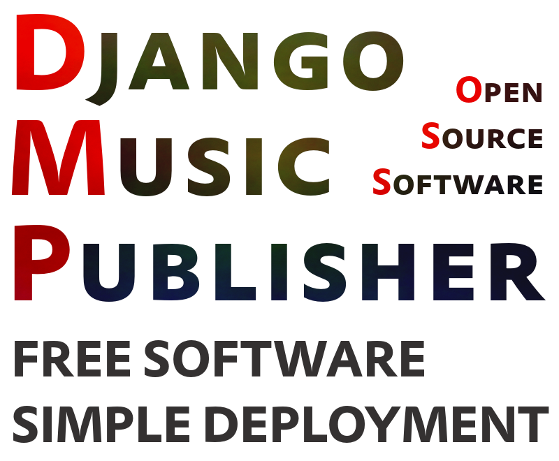

Django-Music-Publisher
++++++++++++++++++++++

Django-Music-Publisher (DMP) is open source software for **managing music metadata, registration/licencing and royalty processing**.

.. toctree::
   :maxdepth: 1

   introduction
   installation
   releases
   LICENSE
   manual
   videos
   modules

* Code: https://github.com/matijakolaric-com/django-music-publisher/
* PYPI: https://pypi.org/project/django-music-publisher/
