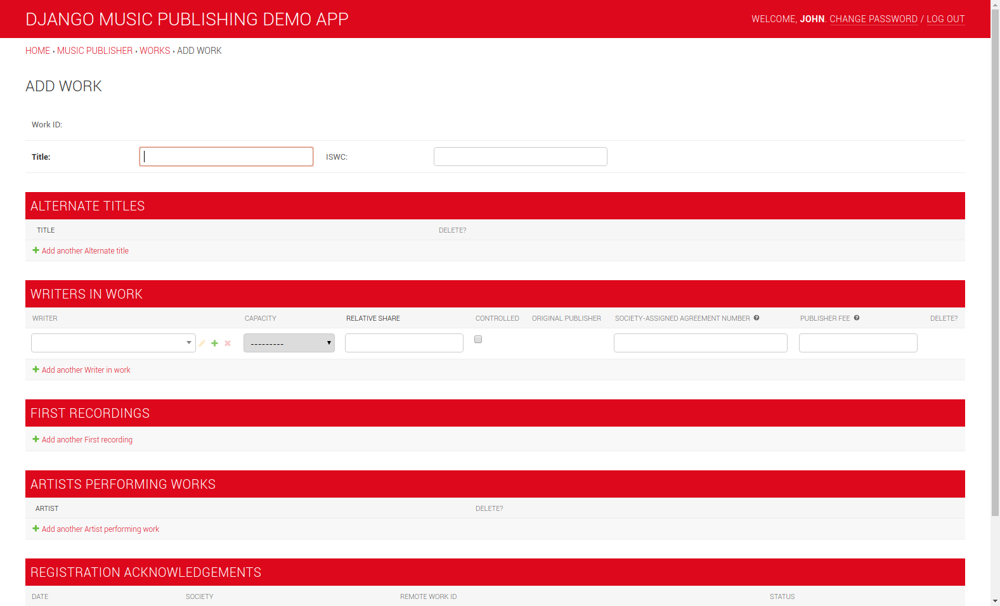

Django Music Publisher
++++++++++++++++++++++

.. image:: https://travis-ci.com/matijakolaric-com/django-music-publisher.svg?branch=master
    :target: https://travis-ci.com/matijakolaric-com/django-music-publisher
    :alt: Build Status
.. image:: https://readthedocs.org/projects/django-music-publisher/badge/?version=latest
    :target: https://django-music-publisher.readthedocs.io/en/latest/?badge=latest
    :alt: Documentation Status
.. image:: https://coveralls.io/repos/github/matijakolaric-com/django-music-publisher/badge.svg?branch=master
    :target: https://coveralls.io/github/matijakolaric-com/django-music-publisher?branch=master
    :alt: Coverage Status
.. image:: https://img.shields.io/github/license/matijakolaric-com/django-music-publisher.svg
   :target: https://github.com/matijakolaric-com/django-music-publisher/blob/master/LICENSE
    :alt: License
.. image:: https://img.shields.io/github/release/matijakolaric-com/django-music-publisher.svg
    :target: https://github.com/matijakolaric-com/django-music-publisher/
    :alt: Latest Release
.. image:: https://img.shields.io/pypi/v/django-music-publisher.svg
    :target: https://pypi.org/project/django-music-publisher/
.. image:: https://img.shields.io/pypi/pyversions/django-music-publisher.svg
    :target: https://pypi.org/project/django-music-publisher/

Django Music Publisher is an open source software for original music publishers.

* Docs: https://django-music-publisher.readthedocs.io/en/stable/
* Code: https://github.com/matijakolaric-com/django-music-publisher/
* PYPI: https://pypi.org/project/django-music-publisher/
* Home: https://matijakolaric.com/articles/2/
* Demo: (Username: ``demo``, Password: ``demo``)

  * World: https://dmp.matijakolaric.com/
  * US: https://dmp.matijakolaric.com/us/

.. toctree::
   :maxdepth: 2

   introduction
   publishing
   demo
   installation
   manual
   releases
   features
   saas
   modules

* :ref:`genindex`
* :ref:`modindex`
