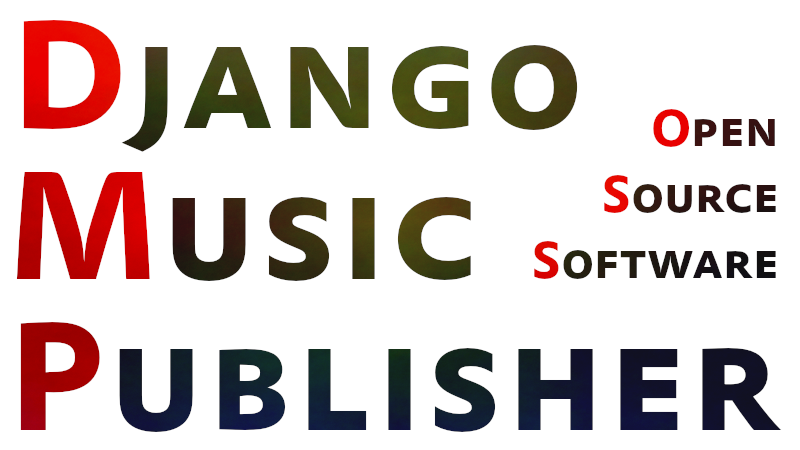

Django-Music-Publisher
++++++++++++++++++++++

Django-Music-Publisher (DMP) is open source software for **managing music metadata**, **registration/licencing of
musical works** and **royalty processing**.

This is the official documentation, including the user manual. Home page of this project, including the installation wizard, is at https://dmp.matijakolaric.com.

.. toctree::
   :maxdepth: 1

   introduction
   installation
   releases
   LICENSE
   manual
   videos
   modules
